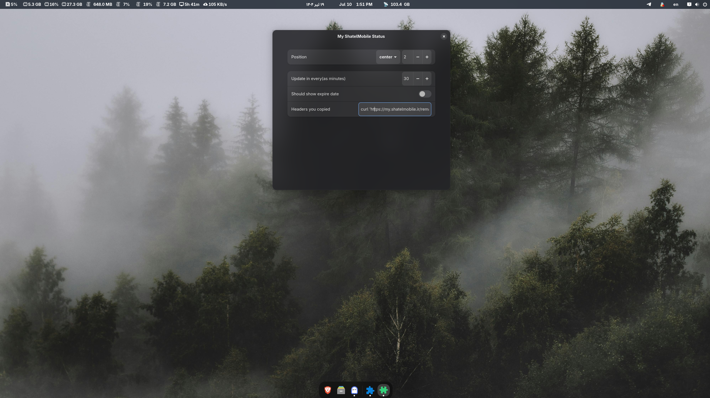

# My ShatelMobile Status

This gnome extension shows your remained internet traffic and expire date of ShatelMobile package.

# ScreenShots

# How to use

First, open [ShatelMobile](https://my.shatelmobile.ir/) website, Login.

Then, You need to open a brower tab and press `F12` to open `Inspect`. Click on the `Network` tab and reload the website.

look for `remained` request.

Right click on it and choose `Copy` -> `Copy as cURL` and paste it on extension's preference window.

